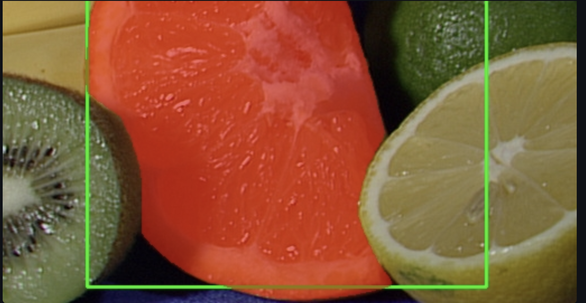
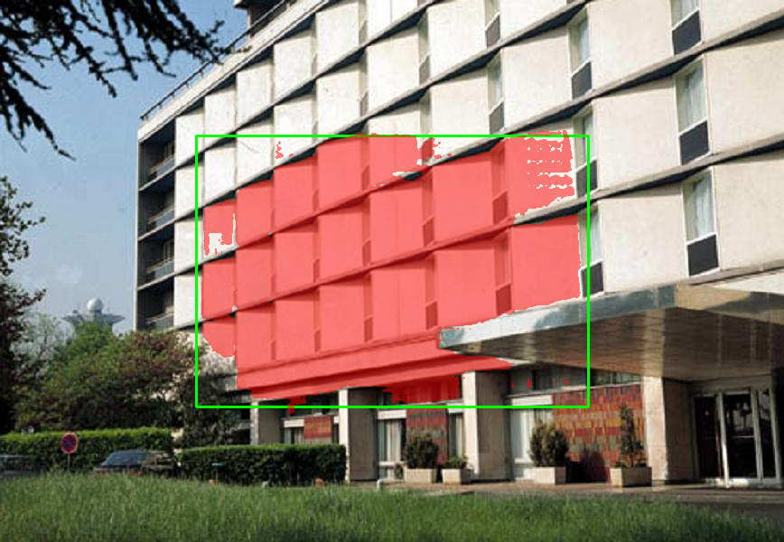
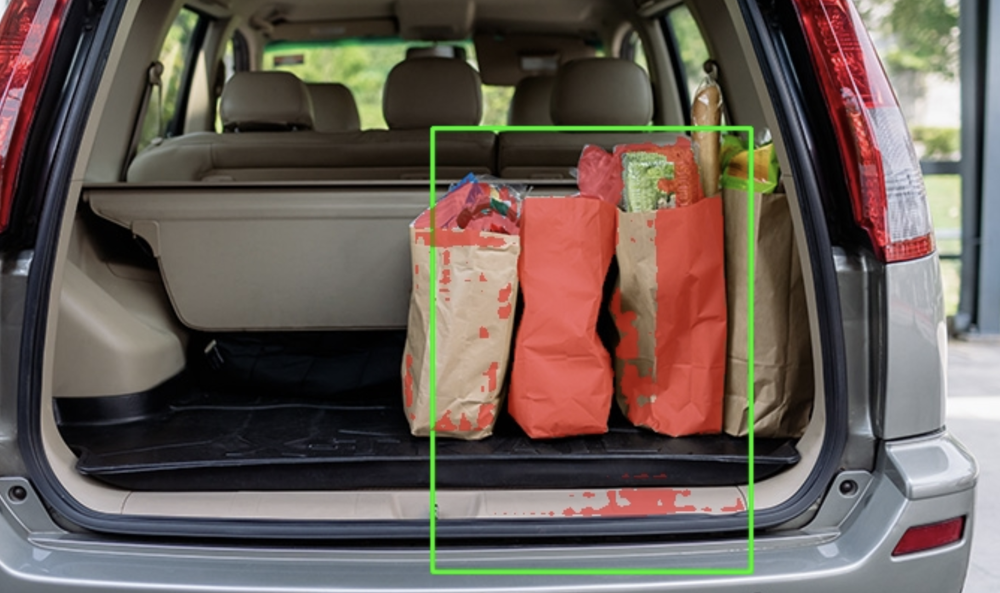

# TP1 – Segmentation interactive avec SAM

## Dépôt

Lien : [à compléter après création du dépôt GitHub]

## Environnement d'exécution

Exécution en local sur MacBook M3 (Apple Silicon). Pas de SLURM ni de nœud GPU distant.
Accélération matérielle via MPS (Metal Performance Shaders, PyTorch).

```
torch 2.11.0
mps True
cuda False
device utilisé : mps
```

Import `segment_anything` : ok — `python -c "import streamlit, cv2, numpy; print('ok'); import segment_anything; print('sam_ok')"` retourne `ok` puis `sam_ok`.

Lancement UI : `streamlit run TP1/src/app.py --server.port 8501` — accessible sur `http://localhost:8501` (pas de tunnel SSH, exécution 100% locale).

## Arborescence TP1/

```
TP1/
├── data/
│   └── images/
├── models/              # Checkpoint SAM (.pth) — non commité
├── outputs/
│   ├── overlays/
│   └── logs/
├── report/
│   ├── report.md
│   └── screenshots/
├── src/
│   ├── app.py
│   ├── sam_utils.py
│   ├── geom_utils.py
│   └── viz_utils.py
├── requirements.txt
└── README.md
```

---

## Exercice 2 – Dataset

10 images placées dans `TP1/data/images/` (sources : dépôt SAM, OpenCV samples, YOLOv5 samples).

| Catégorie | Fichiers |
|-----------|---------|
| Simple (objet principal, fond peu chargé) | `lena.jpg`, `person_simple.jpg`, `fruits.jpg` |
| Chargé (plusieurs objets, fond complexe) | `bus_crowd.jpg`, `building.jpg`, `groceries.jpg` |
| Difficile (texture fine / transparence) | `baboon.jpg` (fourrure), `transparent_obj.png` (objet transparent) |
| Autres | `truck.jpg`, `cars.jpg` |

**5 images représentatives :**

1. `fruits.jpg` — légumes/fruits bien délimités sur fond sombre, fort contraste couleur, cas simple idéal pour valider le pipeline.
2. `groceries.jpg` — sacs dans le coffre d'une voiture, plusieurs objets imbriqués de couleurs proches, fond complexe.
3. `bus_crowd.jpg` — scène urbaine, bus + personnes au premier plan, entités de tailles très différentes.
4. `baboon.jpg` — gros plan fourrure à fort détail texturé ; les contours du masque sont difficiles à segmenter précisément.
5. `transparent_obj.png` — objet transparent, faible contraste avec le fond, cas limite pour la détection de contours.

**Cas simple (`fruits.jpg`) :**



**Cas complexe (`groceries.jpg`) :**


---

## Exercice 3 – Chargement SAM et inférence

Modèle utilisé : **vit_b** (`sam_vit_b_01ec64.pth`). Choix justifié par les contraintes matérielles (M3 MPS, pas de CUDA) : vit_b offre un bon compromis vitesse/qualité en inférence locale.

Test rapide (image `baboon.jpg`, bbox [50, 50, 250, 250]) :

```
img (1500, 2250, 3)  mask (1500, 2250)  score 0.781  mask_sum 11299
```

Le modèle se charge correctement sur MPS. Le masque a bien la même shape que l'image d'entrée et le score de confiance (0.781) est cohérent pour une bbox arbitraire. L'inférence est rapide (~2 s sur M3), sans nécessiter de GPU dédié.

---

## Exercice 4 – Mesures et visualisation

Résultats sur 3 images avec bbox centrée (quart central de l'image) :

| Image | Score | Aire (px) | Périmètre (px) |
|-------|------:|----------:|---------------:|
| `baboon.jpg` | 0.926 | 36 081 | 1 252.9 |
| `building.jpg` | 0.944 | 94 391 | 2 527.6 |
| `bus_crowd.jpg` | 0.768 | 124 709 | 3 210.1 |

Overlays sauvegardés dans `TP1/outputs/overlays/`.



L'overlay permet de débugger le modèle visuellement : on voit immédiatement si le masque déborde sur des objets voisins ou s'il manque une partie de l'objet cible. Sur `bus_crowd.jpg` (score 0.768), la bbox englobe plusieurs entités distinctes — le score plus bas reflète cette ambiguïté. Sur `building.jpg` (score 0.944), le masque est propre et cohérent avec la structure architecturale.

---

## Exercice 5 – Mini-UI Streamlit

UI lancée localement sur `http://localhost:8501`. Testée sur 3 images :

| Image | Bbox (x1, y1, x2, y2) | Score | Aire (px) | Périmètre | Temps (ms) |
|-------|----------------------|------:|----------:|----------:|-----------:|
| `fruits.jpg` | 74, 43, 346, 476 | 0.992 | 81 183 | 1 243.6 | 2 113.8 |
| `bus_crowd.jpg` | 97, 248, 785, 534 | 0.686 | 32 224 | 2 341.1 | 2 080.1 |
| `groceries.jpg` | 369, 139, 595, 392 | 0.747 | 23 825 | 2 584.0 | 1 921.6 |





**UI accessible localement : oui** — `streamlit run TP1/src/app.py --server.port 8501`.

**Observations :**

- `fruits.jpg` (score 0.99) : bbox centrée sur le poivron rouge — masque très propre, SAM isole parfaitement l'objet grâce au fort contraste couleur.
- `bus_crowd.jpg` (score 0.69) : la bbox inclut à la fois des personnes et le toit du bus. SAM hésite entre les entités, le masque se fragmente.
- `groceries.jpg` (score 0.75) : plusieurs sacs de couleurs similaires dans la bbox + débordement sur le plancher du coffre.

**Effet de la taille de la bbox :** une bbox plus grande inclut plus d'objets voisins → score généralement plus bas, masque plus fragmenté. Une bbox serrée autour d'un seul objet → score élevé, masque net. La bbox est donc le principal levier de contrôle de la qualité de segmentation sans point de guidage.

---

## Exercice 6 – Points FG/BG + multimask

Test sur `groceries.jpg` — même bbox que l'exercice 5, ajout d'un point FG au centre du sac rouge :

| Mode | Score | Aire (px) | Périmètre | Temps (ms) |
|------|------:|----------:|----------:|-----------:|
| Bbox seule | 0.747 | 23 825 | 2 584.0 | 1 921.6 |
| Bbox + 1 point FG | **0.944** | 29 042 | 2 370.6 | 4 577.9 |


L'ajout d'un seul point foreground fait passer le score de 0.747 à 0.944 : SAM lève l'ambiguïté entre les sacs et isole correctement le sac rouge. Le temps de traitement double (~4.5 s vs ~2 s) car `set_image` est rappelé avec les coordonnées de points supplémentaires.

Les points BG sont utiles quand le fond est inclus dans la bbox (ex : plancher du coffre) — un seul point BG suffit à l'exclure du masque sans modifier la bbox.

---

## Réflexion finale

**Limites observées :**

- Sans point de guidage, SAM ne résout pas l'ambiguïté quand plusieurs objets similaires se trouvent dans la bbox. Le score reflète cette incertitude, mais l'utilisateur doit interpréter le résultat lui-même.
- Sur M3 (MPS), l'inférence prend ~2 s par requête avec vit_b. vit_h serait trop lent sans GPU dédié. Pour une UI interactive fluide, un modèle plus léger (EfficientSAM, MobileSAM) serait nécessaire.
- La saisie bbox par 4 sliders est fonctionnelle mais peu ergonomique : un vrai cas d'usage demanderait un dessin direct sur l'image.
- Le modèle est gardé en mémoire via `@st.cache_resource` — efficace pour une session, mais la mémoire n'est pas libérée entre les images.

**Pistes d'industrialisation :**

- Remplacer les sliders par un composant de dessin interactif (`streamlit-drawable-canvas`) pour une UX réaliste.
- Architecture de service : SAM comme microservice GPU exposé via API REST, UI en client léger — séparation claire calcul / présentation.
- Cache d'embeddings image : `predictor.set_image` est coûteux ; si l'image ne change pas, réutiliser l'embedding et ne relancer que le décodeur de masque.
- Pour la production, SAM 2 (Meta, 2024) offre de meilleures performances sur images statiques et supporte la vidéo, avec des variantes légères adaptées au déploiement.
- Traçabilité : logger les paramètres (image, bbox, points, score, temps) dans `outputs/logs/` au format JSON pour reproductibilité et audit.
