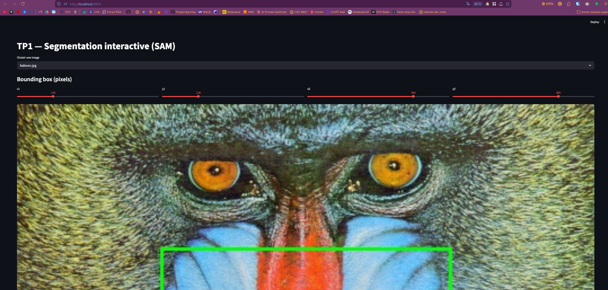
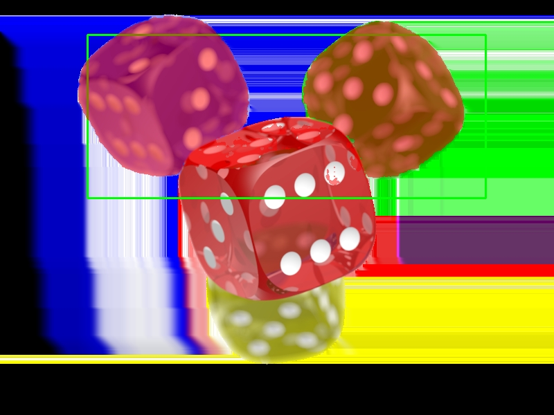
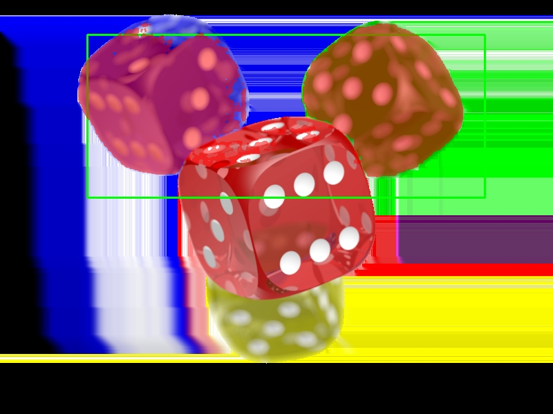

# TP1 – Segmentation interactive avec SAM

## Dépôt

Lien : https://github.com/aramz33/CSC8608

## Exercice 1 – Initialisation, environnement et lancement UI

**Environnement d'exécution :** MacBook M3 (Apple Silicon). Pas de SLURM ni de nœud GPU distant — exécution 100% locale avec MPS (Metal Performance Shaders, PyTorch).

```
torch 2.11.0
mps True
cuda False
device utilisé : mps
```

Import `segment_anything` vérifié :
```bash
python -c "import streamlit, cv2, numpy; print('ok'); import segment_anything; print('sam_ok')"
# → ok
# → sam_ok
```

Lancement UI : `streamlit run TP1/src/app.py --server.port 8501` — accessible sur `http://localhost:8501`.



## Arborescence TP1/

```
TP1/
├── data/
│   └── images/
├── models/              # Checkpoint SAM (.pth) — non commité
├── outputs/
│   ├── overlays/
│   └── logs/
├── report/
│   ├── report.md
│   └── screenshots/
├── src/
│   ├── app.py
│   ├── sam_utils.py
│   ├── geom_utils.py
│   └── viz_utils.py
├── requirements.txt
└── README.md
```

---

## Exercice 2 – Dataset

10 images placées dans `TP1/data/images/` (sources : dépôt SAM, OpenCV samples, YOLOv5 samples).

| Catégorie | Fichiers |
|-----------|---------|
| Simple (objet principal, fond peu chargé) | `lena.jpg`, `person_simple.jpg`, `fruits.jpg` |
| Chargé (plusieurs objets, fond complexe) | `bus_crowd.jpg`, `building.jpg`, `groceries.jpg` |
| Difficile (texture fine / transparence) | `baboon.jpg` (fourrure), `transparent_obj.png` (objet transparent) |
| Autres | `truck.jpg`, `cars.jpg` |

**5 images représentatives :**

1. `fruits.jpg` — légumes/fruits bien délimités sur fond sombre, fort contraste couleur, cas simple idéal pour valider le pipeline.
2. `groceries.jpg` — sacs dans le coffre d'une voiture, plusieurs objets imbriqués de couleurs proches, fond complexe.
3. `bus_crowd.jpg` — scène urbaine, bus + personnes au premier plan, entités de tailles très différentes.
4. `baboon.jpg` — gros plan fourrure à fort détail texturé ; les contours du masque sont difficiles à segmenter précisément.
5. `transparent_obj.png` — objet transparent, faible contraste avec le fond, cas limite pour la détection de contours.

**Cas simple (`fruits.jpg`) :**


**Cas complexe (`groceries.jpg`) :**


---

## Exercice 3 – Chargement SAM et inférence

Modèle utilisé : **vit_b** (`sam_vit_b_01ec64.pth`). Choix justifié par les contraintes matérielles (M3 MPS, pas de CUDA) : vit_b offre un bon compromis vitesse/qualité en inférence locale.

Test rapide (image `baboon.jpg`, bbox [50, 50, 250, 250]) :

```
img (512, 512, 3)  mask (512, 512)  score 0.871  mask_sum 9016
```

Le modèle se charge correctement sur MPS. Le masque a la même shape que l'image d'entrée (512×512) et le score 0.871 est cohérent pour une bbox arbitraire sur fourrure dense. L'inférence est quasi-instantanée sur M3 sans GPU dédié.

---

## Exercice 4 – Mesures et visualisation

Résultats sur 3 images avec bbox centrée (quart central de l'image) :

| Image | Score | Aire (px) | Périmètre (px) |
|-------|------:|----------:|---------------:|
| `baboon.jpg` | 0.926 | 36 081 | 1 252.9 |
| `building.jpg` | 0.944 | 94 391 | 2 527.6 |
| `bus_crowd.jpg` | 0.768 | 124 709 | 3 210.1 |

Overlays sauvegardés dans `TP1/outputs/overlays/`.


L'overlay permet de débugger le modèle visuellement : on voit immédiatement si le masque déborde sur des objets voisins ou s'il manque une partie de l'objet cible. Sur `bus_crowd.jpg` (score 0.768), la bbox englobe plusieurs entités distinctes — le score plus bas reflète cette ambiguïté. Sur `building.jpg` (score 0.944), le masque est propre et cohérent avec la structure architecturale.

---

## Exercice 5 – Mini-UI Streamlit

UI lancée localement sur `http://localhost:8501`. Testée sur 3 images :

| Image | Bbox (x1, y1, x2, y2) | Score | Aire (px) | Périmètre | Temps (ms) |
|-------|----------------------|------:|----------:|----------:|-----------:|
| `fruits.jpg` | 74, 43, 346, 476 | 0.992 | 81 183 | 1 243.6 | 2 113.8 |
| `bus_crowd.jpg` | 97, 248, 785, 534 | 0.686 | 32 224 | 2 341.1 | 2 080.1 |
| `groceries.jpg` | 369, 139, 595, 392 | 0.747 | 23 825 | 2 584.0 | 1 921.6 |


**UI accessible localement : oui** — `streamlit run TP1/src/app.py --server.port 8501`.

**Observations :**

- `fruits.jpg` (score 0.99) : bbox centrée sur le poivron rouge — masque très propre, SAM isole parfaitement l'objet grâce au fort contraste couleur.
- `bus_crowd.jpg` (score 0.69) : la bbox inclut à la fois des personnes et le toit du bus. SAM hésite entre les entités, le masque se fragmente.
- `groceries.jpg` (score 0.75) : plusieurs sacs de couleurs similaires dans la bbox + débordement sur le plancher du coffre.

**Effet de la taille de la bbox :** une bbox plus grande inclut plus d'objets voisins → score généralement plus bas, masque plus fragmenté. Une bbox serrée autour d'un seul objet → score élevé, masque net. La bbox est donc le principal levier de contrôle de la qualité de segmentation sans point de guidage.

---

## Exercice 6 – Points FG/BG + multimask

### Image 1 – `groceries.jpg` (objets imbriqués, couleurs proches)

Même bbox que l'exercice 5, ajout d'un point FG au centre du sac rouge :

| Mode | Points utilisés | Score | Aire (px) | Périmètre | Temps (ms) |
|------|----------------|------:|----------:|----------:|-----------:|
| Bbox seule | — | 0.747 | 23 825 | 2 584.0 | 1 921.6 |
| Bbox + 1 pt FG | (482, 265) FG | **0.944** | 29 042 | 2 370.6 | 4 577.9 |


Masque candidat retenu : index 0 (meilleur score). L'ajout d'un point FG fait passer le score de 0.747 à 0.944 — SAM lève l'ambiguïté entre les sacs et isole correctement le sac rouge.

---

### Image 2 – `transparent_obj.png` (dés transparents, occultation, fond noir)

Bbox englobant les deux dés du haut (x1=113, y1=23, x2=669, y2=267) :

| Mode | Points utilisés | Score | Aire (px) | Périmètre | Temps (ms) |
|------|----------------|------:|----------:|----------:|-----------:|
| Bbox seule | — | **0.944** | 75 082 | 2 566.9 | 1 934.3 |
| Bbox + 1 pt FG | centre dé rouge | 0.883 | 82 667 | 2 292.6 | 1 914.8 |





Masque candidat retenu : index 0. Résultat contre-intuitif : le point FG *baisse* le score (0.944 → 0.883) et élargit le masque (+7 585 px). Sur un fond noir uniforme, SAM distingue déjà bien les dés sans guidage — ajouter un point FG sur le dé rouge l'incite à agréger les dés voisins plutôt qu'à isoler la cible, ce qui nuit à la précision.

**Bilan comparatif :** les points BG sont indispensables quand la bbox capture un fond non-uniforme ou des entités parasites proches de l'objet cible (`groceries.jpg` : plancher du coffre). Sur fond homogène (`transparent_obj.png`), la bbox seule suffit — les points FG peuvent dégrader le résultat si les objets voisins sont de même nature. Les cas qui restent difficiles : occultation partielle (dés superposés), transparence (contours mal définis par l'alpha), et objets multiples identiques dans la même bbox sans point BG explicite pour les exclure.

---

## Exercice 7 – Bilan et réflexion

**Facteurs principaux d'échec de segmentation :**

Trois facteurs expliquent la majorité des segmentations de mauvaise qualité observées. Premièrement, l'ambiguïté de la bbox : quand elle englobe plusieurs objets similaires (ex. `groceries.jpg`, plusieurs sacs de même couleur), SAM ne peut pas déterminer seul l'objet cible — le score chute et le masque capture une union arbitraire des objets. Solution actionnable : forcer une contrainte de ratio (aire_bbox / aire_image < 0.25) et avertir l'utilisateur si la bbox contient vraisemblablement plusieurs entités (heuristique : score < 0.75 + périmètre élevé). Deuxièmement, les textures et transparences : sur `baboon.jpg` (fourrure dense) et `transparent_obj.png`, les contours sont mal définis et SAM produit des masques fragmentés ou imprécis. Le seul remède fiable est d'ajouter des points FG/BG pour guider le décodeur. Troisièmement, la résolution d'entrée : vit_b travaille sur des embeddings 64×64, ce qui perd le détail fin sur les petits objets ou les bords complexes — passer à vit_h ou utiliser des patches à plus haute résolution améliore la précision au coût d'une latence plus élevée.

**Signaux à monitorer en production :**

Pour détecter des régressions ou une dérive sans relire les masques manuellement, cinq signaux mesurables suffisent à couvrir les défaillances critiques. (1) **Score de confiance moyen** (rolling 7 jours) : une baisse soutenue indique une dérive de la distribution des images d'entrée — les bboxes proposées deviennent moins adaptées au type d'images traitées. (2) **Taux de masques vides** (`aire == 0`) : doit rester < 1 % ; un pic signale soit un bug d'intégration (bbox hors image), soit une régression du modèle après mise à jour. (3) **Latence d'inférence p95** : une hausse progressive sans changement de charge détecte une fuite mémoire (embedding non libéré) ou une saturation GPU ; un seuil d'alerte à +30 % de la baseline suffit. (4) **Distribution des aires de masques** (moyenne et écart-type) : une dérive de la moyenne détecte un changement du type de requêtes (objets plus petits/grands) ; un écart-type qui explose révèle des bboxes incohérentes soumises par les utilisateurs. (5) **Taux de sauvegarde overlay** (clics "Sauvegarder" / segmentations totales) : proxy de satisfaction — si l'utilisateur ne sauvegarde pas, le masque ne lui convient pas ; une baisse de ce ratio est un signal précoce de dégradation de la qualité perçue avant même que les métriques automatiques ne l'indiquent.
