# TP2 – Génération d'image (Diffusion)

## Dépôt
Lien : [https://github.com/](https://github.com/)

## Environnement d'exécution
- Device : MPS (MacBook M3)
- torch 2.11.0, dtype float32 (MPS)
- Modèle : `stable-diffusion-v1-5/stable-diffusion-v1-5`

## Arborescence TP2/

```
TP2/
  inputs/           # image source img2img
  outputs/          # images générées
  report/
    screenshots/    # captures embarquées
    rapport.md
  app.py
  experiments.py
  pipeline_utils.py
  smoke_test.py
  requirements.txt
```

---

## Exercice 1 – Mise en place & smoke test

Exécution locale sur MPS. Génération 512×512, 25 steps, seed=42.  
Temps de génération : ~40s sur M3 (vs ~5s GPU CUDA).

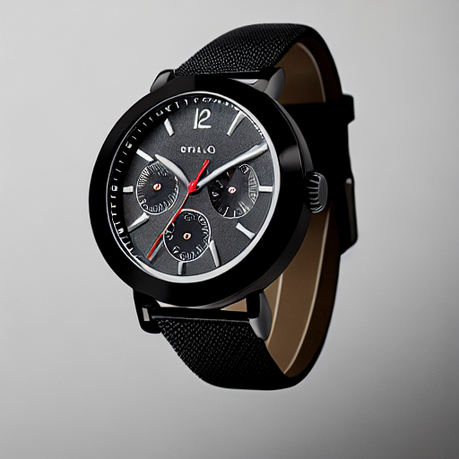

Pas d'OOM. MPS utilise float32 (float16 non supporté sur MPS avec SD v1.5).

---

## Exercice 2 – Factorisation pipeline & baseline

`pipeline_utils.py` centralise : device/dtype, chargement, scheduler, générateur.  
`to_img2img` réutilise `pipe.components` — pas de double chargement des poids.

Baseline (`experiments.py`) :

```
CONFIG: {'model_id': 'stable-diffusion-v1-5/stable-diffusion-v1-5',
         'scheduler': 'EulerA', 'seed': 42, 'steps': 30, 'guidance': 7.5}
```

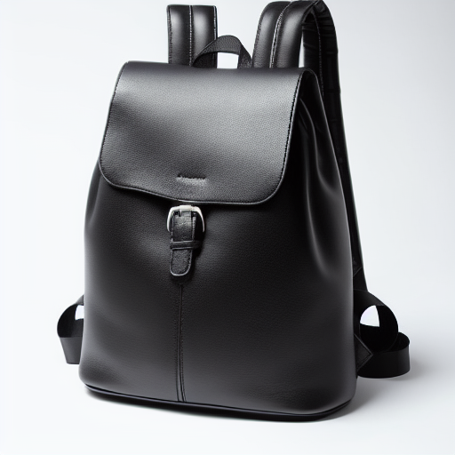

---

## Exercice 3 – Text2Img : 6 expériences contrôlées

Prompt identique pour tous les runs :  
`"ultra-realistic product photo of a leather backpack on a white background, studio lighting, soft shadow, very sharp, 4k"`  
Seed fixe : 42.

| Run | Scheduler | Steps | Guidance | Image |
|-----|-----------|-------|----------|-------|
| 01 baseline | EulerA | 30 | 7.5 |  |
| 02 steps=15 | EulerA | 15 | 7.5 | 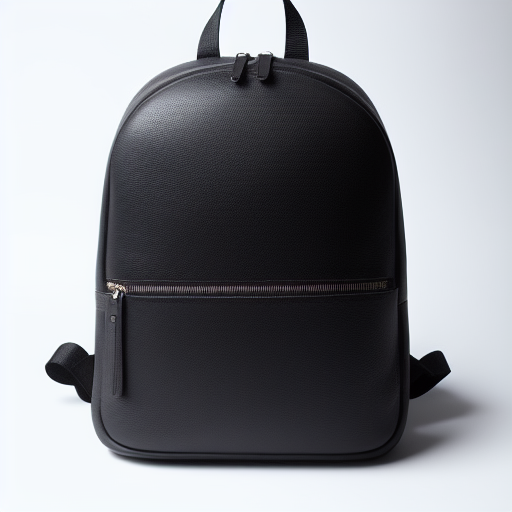 |
| 03 steps=50 | EulerA | 50 | 7.5 | 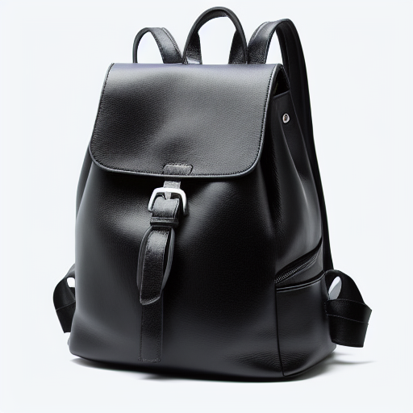 |
| 04 guid=4.0 | EulerA | 30 | 4.0 | 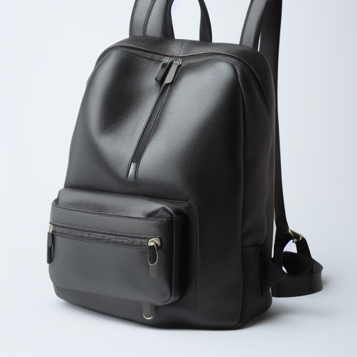 |
| 05 guid=12.0 | EulerA | 30 | 12.0 | 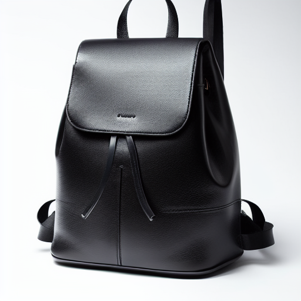 |
| 06 DDIM | DDIM | 30 | 7.5 | 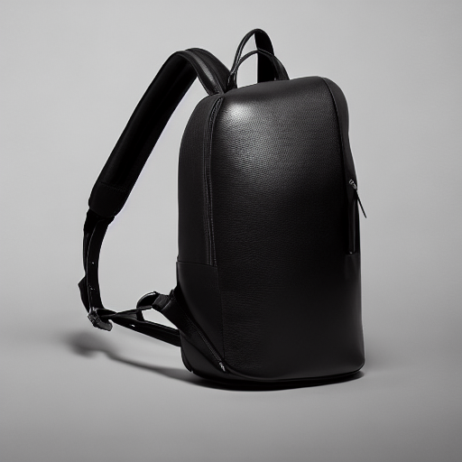 |

### Analyse qualitative

**Effet de `num_inference_steps` :**
- Run02 (15 steps) : forme simplifiée, moins de détails (pas de boucle, surface lisse), léger flou sur les coutures — insuffisant pour usage e-commerce.
- Run03 (50 steps) : plus de détails (poignée, boucle métallique plus nette), rendu cuir plus convaincant — gain marginal vs run01.
- Au-delà de 30 steps, le gain qualitatif devient faible sur SD v1.5 avec EulerA.

**Effet de `guidance_scale` :**
- Run04 (guid=4.0) : composition légèrement inclinée, fond moins blanc, prompt moins respecté — modèle plus "libre".
- Run05 (guid=12.0) : très structuré, contraste élevé, prompt très suivi — mais légère rigidité dans le rendu, artefact de logo potentiel près de la boucle.
- guid=7.5 offre le meilleur équilibre fidélité/naturel.

**Effet du `scheduler` :**
- Run06 (DDIM) : fond gris (pas blanc), angle latéral prononcé, rendu plus photographique mais moins "studio". DDIM tend vers des compositions plus réalistes mais moins conformes au brief e-commerce fond blanc.

---

## Exercice 4 – Img2Img : 3 expériences contrôlées (strength)

Image source : photo produit réelle (sac à dos bleu marine, fond intérieur, lumière naturelle).

| | Image |
|--|-------|
| **Source** | 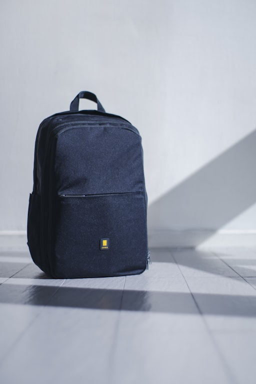 |
| **Run07** strength=0.35 | 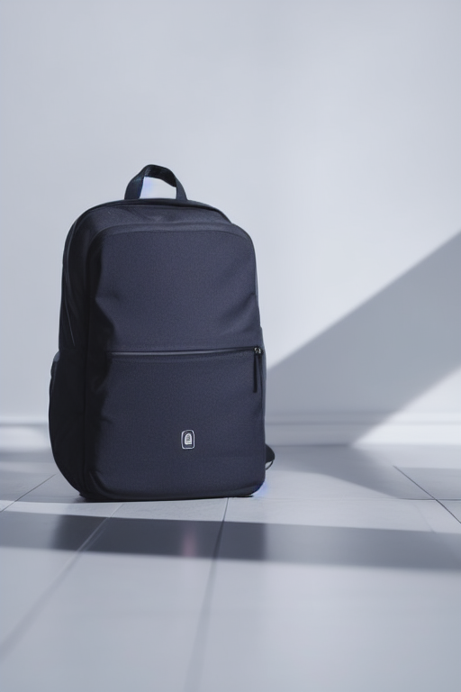 |
| **Run08** strength=0.60 | 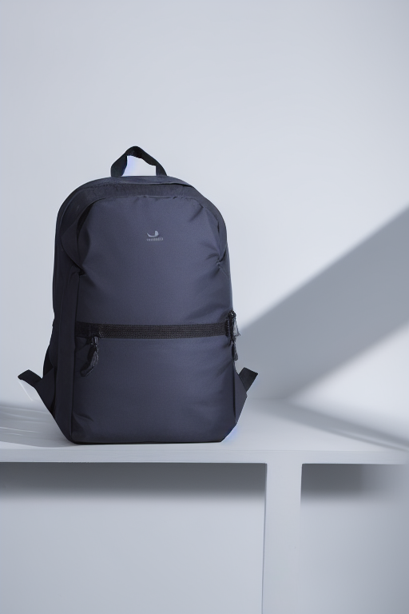 |
| **Run09** strength=0.85 | 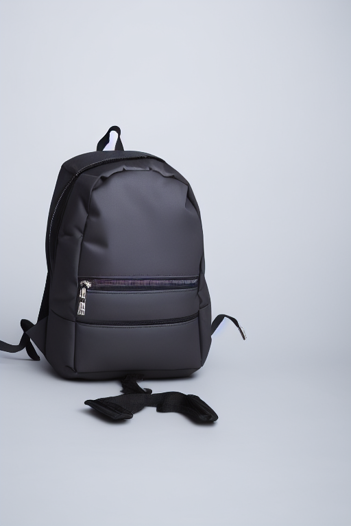 |

Config commune : EulerA, seed=42, steps=30, guidance=7.5.

### Analyse qualitative

**Ce qui est conservé / change selon strength :**

- **strength=0.35** : structure quasi identique à la source (même pose, même position sur le sol, même couleur bleu foncé), fond légèrement nettoyé, ombres adoucies. Produit parfaitement reconnaissable. Meilleur pour retouche discrète.

- **strength=0.60** : fond plus épuré (tendance studio), couleur légèrement décalée (bleu plus neutre), détails de surface retravaillés. L'identité produit reste lisible mais la texture fabric change. Bon compromis.

- **strength=0.85** : dérive significative — couleur devient gris foncé, les sangles se déforment (artefacts pendants), le bag est posé sur une surface blanche abstraite. Le produit n'est plus reconnaissable comme le même article. **Inutilisable en e-commerce** : risque de tromper l'acheteur sur l'apparence réelle.

**Risque e-commerce à strength élevé :** à 0.85 le modèle hallucine les détails — sangles qui flottent, couleur incorrecte, texture inventée. Un client recevrait un produit différent de l'image.

---

## Exercice 5 – Application Streamlit

Application `app.py` : mode Text2Img / Img2Img, sidebar paramètres (seed, steps, guidance, scheduler, strength), cache `@st.cache_resource` sur le pipeline.

Lancement :
```bash
streamlit run TP2/app.py --server.port 8501
```

**Mode Text2Img** (seed=42, steps=30, guidance=7.5, EulerA) :

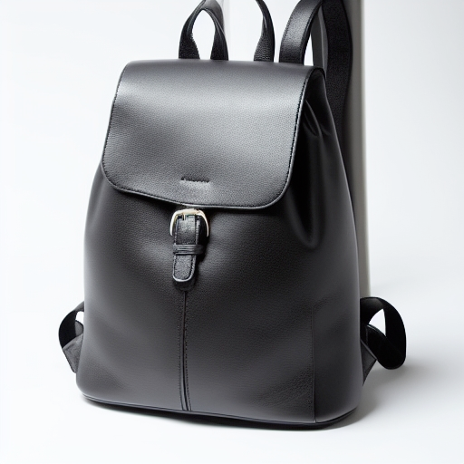

**Mode Img2Img** (seed=42, steps=30, guidance=7.5, EulerA, strength=0.60) :

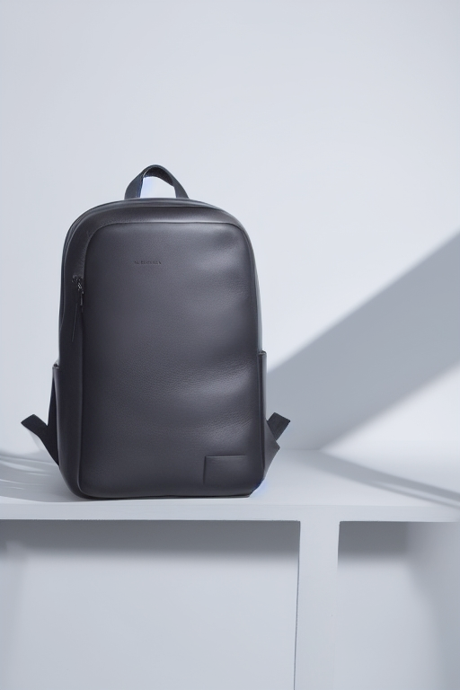

---

## Exercice 6 – Évaluation light + réflexion

### Grille d'évaluation (0–2 par critère, total /10)

| Critère | Run01 baseline | Run05 guid=12 | Run09 i2i str=0.85 |
|---------|---------------|--------------|-------------------|
| Prompt adherence | 2 | 2 | 1 |
| Visual realism | 2 | 2 | 1 |
| Artifacts | 2 | 1 | 0 |
| E-commerce usability | 2 | 1 | 0 |
| Reproducibility | 2 | 2 | 2 |
| **Total /10** | **10** | **8** | **4** |

**Run01 :** fond blanc propre, éclairage studio, pas d'artefact, prompt pleinement respecté. Directement utilisable.  
**Run05 (guid=12) :** très fidèle au prompt mais légère surcontrainte — texture cuir légèrement plastique, possible artefact logo. Utilisable après vérification.  
**Run09 (str=0.85) :** couleur incorrecte (gris vs bleu), sangles déformées/pendantes, produit non reconnaissable. Inutilisable.

### Réflexion finale

**Quality vs latency/cost :** réduire de 30 à 15 steps divise le temps par ~2 mais dégrade visiblement la qualité (moins de détails, surfaces lisses). Passer à 50 steps n'apporte qu'un gain marginal. En production, 20–25 steps avec EulerA ou DPM++ est le sweet spot : bon rendu, coût acceptable. Sur GPU 11GB en float16, une génération 512×512 prend ~3–5s vs ~40s sur M3 MPS en float32 — le scheduler impacte peu la latence, surtout le nombre de steps.

**Reproductibilité :** pour reproduire exactement une image il faut : model_id, scheduler + sa config complète (`from_config`), seed, steps, guidance, prompt exact, negative prompt, résolution, dtype et device. Le point fragile : une mise à jour de diffusers ou du modèle peut casser la reproductibilité même à seed fixe. Le scheduler est particulièrement sensible — DDIM et EulerA avec la même seed et les mêmes steps donnent des images totalement différentes.

**Risques e-commerce :** (1) *Hallucinations* : le modèle invente des logos, textes, détails inexistants (observé à guidance=12 avec un pseudo-logo sur la boucle). (2) *Images trompeuses* : à strength=0.85, la couleur du produit change radicalement — risque légal et retours client. (3) *Conformité* : SD v1.5 génère parfois du texte/logo fantôme même avec negative prompt. Pour limiter ces risques : garder strength ≤ 0.6 en img2img, ajouter une étape de validation humaine, utiliser un classifier de contenu, et ne jamais publier sans comparaison côte-à-côte avec le produit réel.
