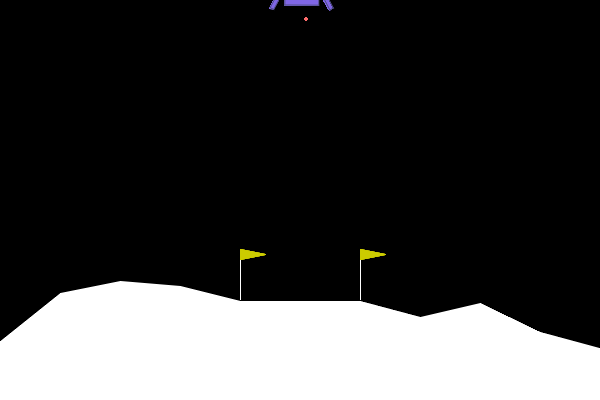
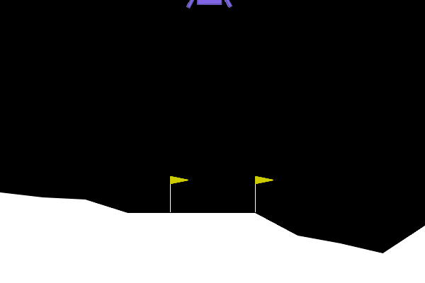
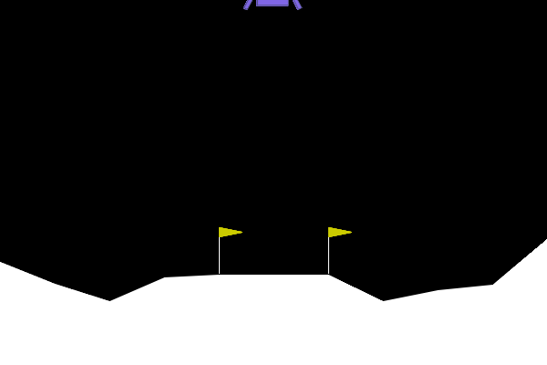
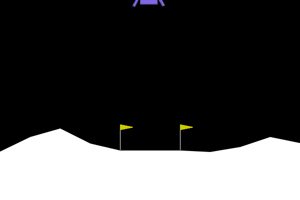

# TP5 – Deep Reinforcement Learning

## Dépôt

Lien : https://github.com/adamramsis/CSC8608

## Environnement d'exécution

| Librairie | Version |
|---|---|
| Python | 3.14 |
| gymnasium | 1.2.2 |
| stable-baselines3 | 2.6.0 |
| Pillow | latest |
| device (entraînement) | CPU (Apple M3) |

## Arborescence TP5/

```
TP5/
  src/
    random_agent.py
    train_and_eval_ppo.py
    reward_hacker.py
    ood_agent.py
  report/
    rapport.md
    screenshots/
  random_agent.gif
  trained_ppo_agent.gif
  hacked_agent.gif
  ood_agent.gif
  requirements.txt
```

---

## Exercice 1 – Comprendre la Matrice et Instrumenter l'Environnement

### Espaces d'état et d'action

```
Espace d'observation (Capteurs) : Box([ -2.5  -2.5  -10.  -10.  -6.28  -10.  -0.  -0. ],
                                       [  2.5   2.5   10.   10.   6.28   10.   1.   1. ], (8,), float32)
Espace d'action (Moteurs) : Discrete(4)
```

L'état est un vecteur de 8 flottants : position (x, y), vitesse (vx, vy), angle θ, vitesse angulaire ω, et deux booléens indiquant si chaque patte a touché le sol. L'espace d'action est discret : 0 = rien, 1 = moteur gauche, 2 = moteur principal, 3 = moteur droit.

### Rapport de vol — agent aléatoire

```
--- RAPPORT DE VOL ---
Issue du vol : CRASH DÉTECTÉ 💥
Récompense totale cumulée : -147.24 points
Allumages moteur principal : 42
Allumages moteurs latéraux : 62
Durée du vol : 141 frames
Vidéo de la télémétrie sauvegardée sous 'random_agent.gif'
```

### GIF — agent aléatoire



### Analyse

Le seuil de résolution de l'environnement est +200 points. L'agent aléatoire obtient -147 points, soit un écart de **~347 points**. Il n'a aucune stratégie : les actions sont tirées uniformément, la consommation de carburant est élevée et non dirigée, et l'atterrissage se termine systématiquement en crash.

---

## Exercice 2 – Entraînement et Évaluation de l'Agent PPO

### Évolution de `ep_rew_mean`

| Étape | ep_rew_mean |
|---|---|
| Début (~2 048 steps) | -171 |
| Milieu (~250 000 steps) | ~+50 |
| Fin (~500 000 steps) | +203 |

La récompense moyenne par épisode démarre très négative (crashes fréquents) et converge progressivement vers +200, franchissant le seuil de résolution en fin d'entraînement.

### Rapport de vol — agent PPO entraîné

```
--- RAPPORT DE VOL PPO ---
Issue du vol : ATTERRISSAGE RÉUSSI 🏆
Récompense totale cumulée : 276.41 points
Allumages moteur principal : 105
Allumages moteurs latéraux : 102
Durée du vol : 341 frames
Vidéo de la télémétrie sauvegardée sous 'trained_ppo_agent.gif'
```

### GIF — agent PPO entraîné



### Comparaison

| Métrique | Agent aléatoire | Agent PPO |
|---|---|---|
| Issue | CRASH | ATTERRISSAGE RÉUSSI |
| Score | -147.24 | +276.41 |
| Moteur principal | 42 allumages | 105 allumages |
| Moteurs latéraux | 62 allumages | 102 allumages |
| Durée | 141 frames | 341 frames |

L'agent PPO atteint largement le seuil de +200 points. Il consomme plus de carburant que l'agent aléatoire, mais de façon **contrôlée et orientée** : les allumages servent à freiner la descente et corriger l'orientation, aboutissant à un atterrissage en douceur.

---

## Exercice 3 – L'Art du Reward Engineering (Reward Hacking)

### Rapport de vol — agent "radin"

```
--- RAPPORT DE VOL PPO HACKED ---
Issue du vol : CRASH DÉTECTÉ 💥
Récompense totale cumulée : -110.38 points
Allumages moteur principal : 0
Allumages moteurs latéraux : 86
Durée du vol : 86 frames
Vidéo du nouvel agent sauvegardée sous 'hacked_agent.gif'
```

### GIF — agent hacked



### Analyse du comportement

L'agent n'allume **jamais** le moteur principal (0 allumages). Il utilise uniquement les moteurs latéraux, et finit par s'écraser.

### Explication mathématique

La récompense modifiée pour l'action "moteur principal" (action 2) est :

```
r'(s, a=2) = r(s, a=2) - 50
```

La pénalité de -50 est massive par rapport aux gains normaux de l'environnement (freinage ≈ +0.1 à +1 par frame, atterrissage = +100). L'agent apprend par gradient de politique que :

```
E[Σ r'] | allume moteur principal  <<  E[Σ r'] | n'allume pas
```

Il converge donc vers une politique déterministe qui **évite totalement l'action 2**, même si cela mène au crash. Du point de vue de la fonction de récompense modifiée, c'est optimal : un crash coûte -100 une seule fois, alors qu'allumer le moteur principal pendant 50 frames coûterait -2 500. L'agent "trouve la faille" dans la spécification de la récompense — c'est le **reward hacking** : maximiser le score formel sans accomplir la tâche réelle.

---

## Exercice 4 – Robustesse et Changement de Physique (Généralisation OOD)

### Rapport de vol — agent OOD (gravité -2.0)

```
--- RAPPORT DE VOL PPO (GRAVITÉ MODIFIÉE) ---
Issue du vol : CRASH DÉTECTÉ 💥
Récompense totale cumulée : -97.97 points
Allumages moteur principal : 15
Allumages moteurs latéraux : 196
Durée du vol : 318 frames
Vidéo de la télémétrie sauvegardée sous 'ood_agent.gif'
```

### GIF — agent OOD



### Analyse

L'agent entraîné avec g = -10.0 échoue sous g = -2.0. Le vaisseau flotte trop lentement, l'agent sur-corrige et finit par sortir de zone ou s'écraser. Techniquement, la politique apprise est une fonction π(s) → a qui a internalisé la dynamique de chute à g = -10. Sous g = -2, les mêmes observations s produisent des états physiques très différents (décélération plus lente, inertie différente) : la politique est **out-of-distribution** par rapport aux données d'entraînement, et ses prédictions d'action ne correspondent plus à la physique réelle.

---

## Exercice 5 – Bilan Ingénieur : Le défi du Sim-to-Real

### Stratégie 1 — Domain Randomization (randomisation de domaine)

Entraîner avec une gravité tirée aléatoirement à chaque épisode dans [−12.0, 0.0] (et éventuellement un vent variable). Le modèle voit une distribution de physiques pendant l'entraînement et apprend une politique robuste qui fonctionne sous toutes ces conditions. En pratique, cela se fait avec un second `Wrapper` qui modifie `gravity` à chaque `reset()`. Le coût est un léger allongement de la convergence, mais sans augmenter la taille du réseau ni stocker plusieurs modèles.

### Stratégie 2 — Augmentation de l'espace d'observation

Ajouter la gravité courante comme composante de l'observation (vecteur d'état de taille 9 au lieu de 8). L'agent dispose alors d'un contexte physique explicite et peut adapter sa politique en conséquence — équivalent à lui donner un "capteur de masse planétaire". Combiné à une distribution variée de gravités en entraînement (stratégie 1), cette approche produit un agent conditionnellement robuste : une seule politique, informée du paramètre physique, capable de se poser sur n'importe quelle lune dans la plage connue.
