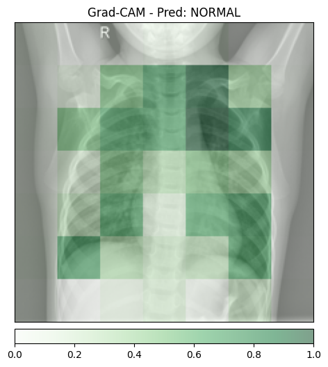
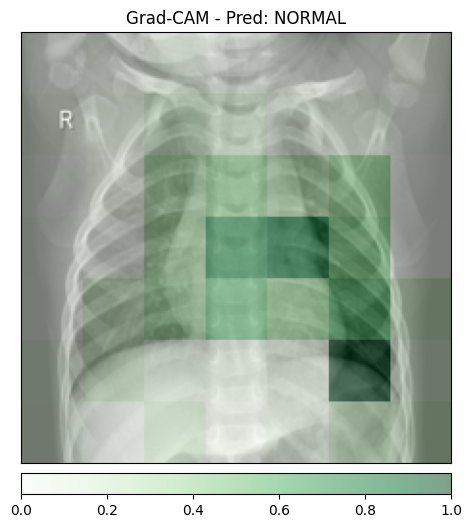
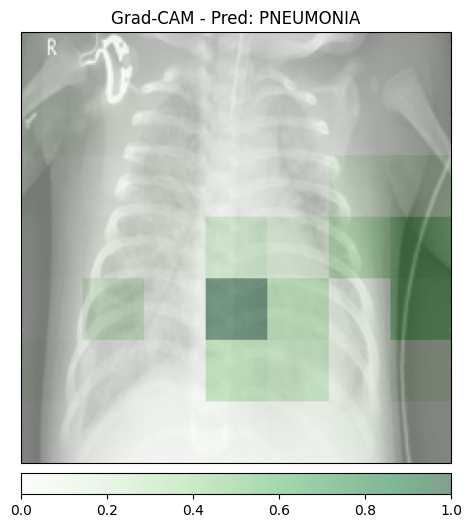
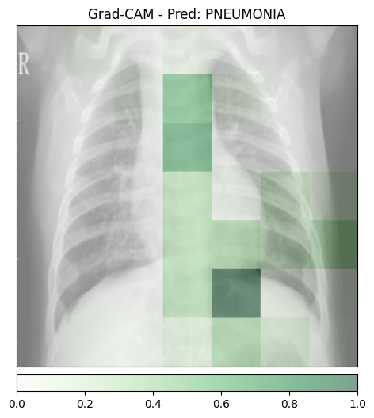
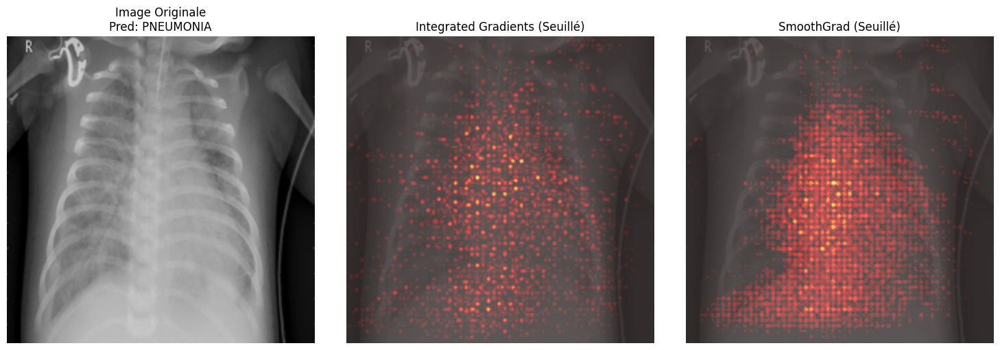
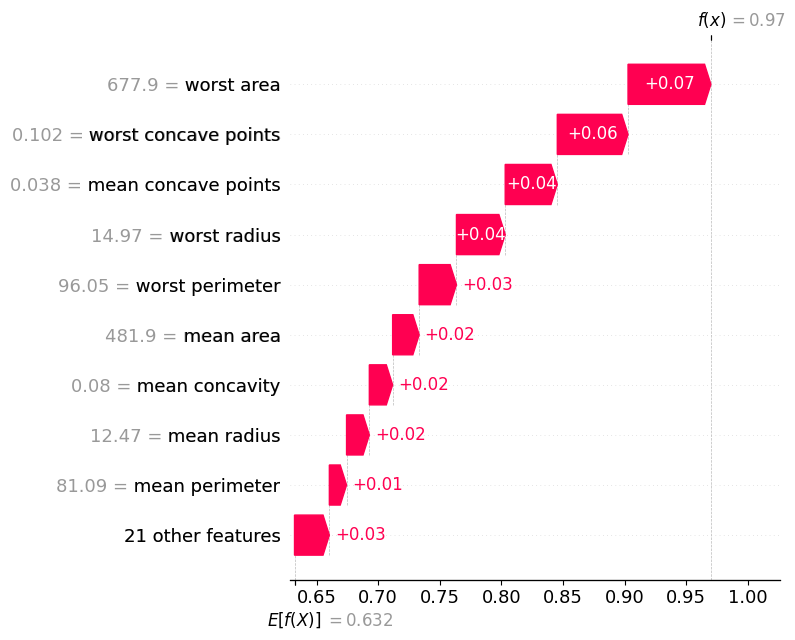
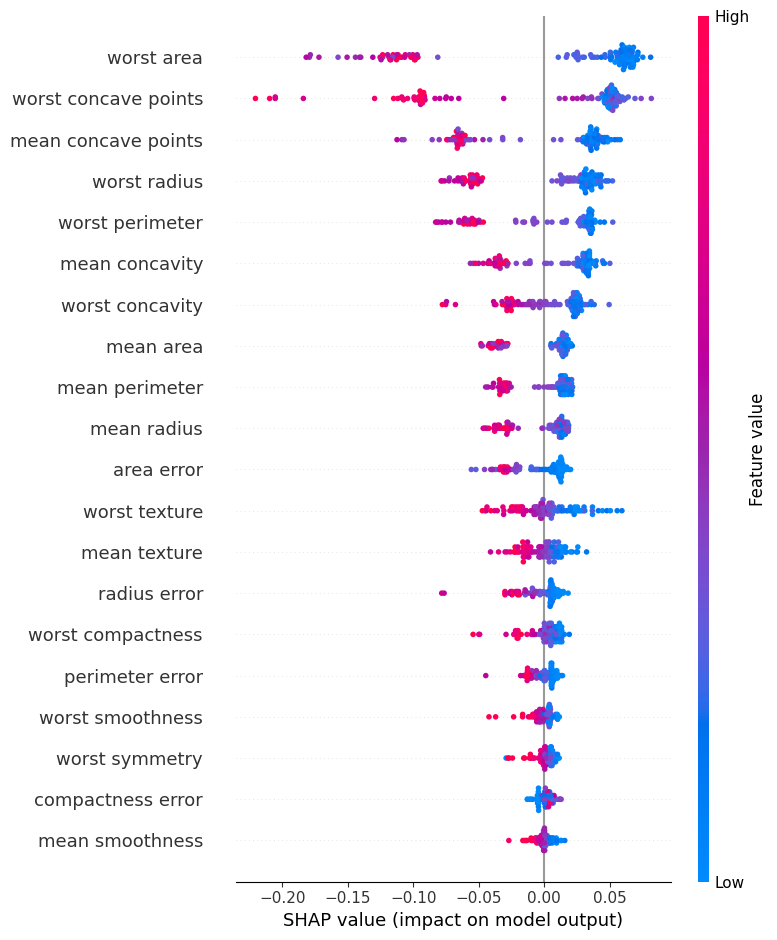

# TP6 – XAI : IA Explicable et Interprétable

## Dépôt

Lien : https://github.com/adamramsis/CSC8608

## Environnement d'exécution

- Machine : MacBook M3 (Apple Silicon)
- Device : MPS (`torch.backends.mps.is_available() = True`)
- Python 3.14, PyTorch, Captum, Transformers, scikit-learn, SHAP

## Arborescence TP6/

```text
TP6/
  data/               # images (ignoré par .gitignore)
  outputs/
    gradcam/
    ig/
    tabular/
  rapport/
    rapport.md
  01_gradcam.py
  02_ig.py
  03_glassbox.py
  04_shap.py
  requirements.txt
```

---

## Exercice 1 – Mise en place, inférence et Grad-CAM

### Résultats d'inférence

| Image    | Classe prédite | Temps inférence | Temps Grad-CAM |
|----------|---------------|-----------------|----------------|
| normal_1 | NORMAL        | 0.0184 s        | 0.0263 s       |
| normal_2 | NORMAL        | 0.0284 s        | 0.0181 s       |
| pneumo_1 | PNEUMONIA     | 0.0262 s        | 0.2111 s       |
| pneumo_2 | PNEUMONIA     | 0.0236 s        | 0.0353 s       |

### Visualisations Grad-CAM

**normal_1 (prédit : NORMAL)**



**normal_2 (prédit : NORMAL)**



**pneumo_1 (prédit : PNEUMONIA)**



**pneumo_2 (prédit : PNEUMONIA)**



### Analyse des faux positifs (effet Clever Hans)

Sur les deux images saines testées, le modèle produit la bonne prédiction (NORMAL). Aucun faux positif n'a été observé pour ce jeu d'images. Si une telle erreur se produisait, la carte Grad-CAM permettrait de distinguer deux cas : soit le modèle se concentre sur une zone parenchymateuse réellement anormale (prédiction fondée médicalement), soit il s'active sur un artefact périphérique — fond noir, étiquette radio, positionnement atypique — sans lien avec les poumons (effet Clever Hans). Dans ce second cas, la zone colorée se situerait typiquement en bordure d'image ou sur des structures non pulmonaires.

### Granularité de l'explication

Les zones colorées forment de gros blocs flous. La cause est structurelle : la dernière couche convolutive de ResNet50 produit des cartes de features de taille 7×7 (l'image d'entrée 224×224 est sous-échantillonnée 32 fois par les cinq blocs résiduels). Grad-CAM calcule ses attributions sur ces cartes 7×7, puis les reporte à la résolution originale par interpolation bilinéaire. Cette extrapolation ne restitue aucune information spatiale supplémentaire : les 49 valeurs étalées sur 50 176 pixels donnent inévitablement un résultat flou.

---

## Exercice 2 – Integrated Gradients et SmoothGrad

### Visualisation comparative (pneumo_1)



### Temps d'exécution

| Méthode                                   | Temps       |
|-------------------------------------------|-------------|
| Inférence seule                           | 0.0276 s    |
| Integrated Gradients (50 étapes)          | 2.7044 s    |
| SmoothGrad (IG × 100 échantillons bruités) | 624.04 s (~10 min) |

### Faisabilité d'un déploiement temps réel

SmoothGrad prend environ 10 minutes sur MPS pour une seule image, soit ~22 600 fois le temps d'inférence. Une génération synchrone au premier clic est impossible. **Architecture proposée** : découpler l'inférence (retour immédiat de la classe prédite) du calcul d'explicabilité via une file de travaux asynchrones (par exemple Celery + Redis) ; le médecin reçoit la prédiction instantanément et la carte XAI est poussée dans l'interface lorsqu'elle est disponible.

### Avantage mathématique d'Integrated Gradients face à Grad-CAM

Grad-CAM applique un ReLU final sur les activations moyennées, supprimant toutes les contributions négatives — il ne montre que les pixels qui *activent* la classe cible. Integrated Gradients n'applique pas ce filtre : les attributions peuvent descendre en dessous de zéro, révélant aussi les régions qui *inhibent* la prédiction. On dispose ainsi d'une carte signée complète, garantie exacte par la propriété de complétude (théorème fondamental du calcul intégral) : la somme des attributions est égale à la différence de sortie entre l'image et la baseline.

---

## Exercice 3 – Modélisation intrinsèquement interprétable (Glass-box)

### Résultat

```
Accuracy de la Régression Logistique : 0.9737
```

### Importance des variables


**Top 3 variables poussant vers la classe Maligne (coefficients négatifs) :**

| Feature        | Coefficient |
|----------------|-------------|
| worst texture  | −1.3506     |
| radius error   | −1.2682     |
| worst symmetry | −1.2082     |

La caractéristique ayant le plus d'impact vers la classe Maligne est **worst texture** (−1.35) : une forte valeur de texture maximale augmente significativement la probabilité d'une tumeur maligne.

### Avantage d'un modèle intrinsèquement interprétable

Avec un modèle Glass-box, les coefficients *sont* l'explication — il n'y a pas d'approximation post-hoc ni de fidélité à questionner. L'interprétabilité est garantie par construction, sans surcost de calcul.

---

## Exercice 4 – Explicabilité post-hoc avec SHAP sur un modèle complexe

### Résultat

```
Accuracy du Random Forest : 0.9649
```

### Visualisations SHAP

**Explicabilité locale — Patient 0 (Waterfall Plot)**



**Explicabilité globale — Summary Plot**



### Explicabilité globale : comparaison RF (SHAP) vs Régression Logistique

Top 5 variables selon SHAP (Random Forest) :

| Rang | Feature              | Mean \|SHAP\| |
|------|----------------------|--------------|
| 1    | worst area           | 0.0769       |
| 2    | worst concave points | 0.0694       |
| 3    | mean concave points  | 0.0491       |
| 4    | worst radius         | 0.0405       |
| 5    | worst perimeter      | 0.0396       |

La Régression Logistique identifiait **worst texture**, **radius error** et **worst symmetry** comme variables dominantes. Le Random Forest met en avant **worst area** et **worst concave points**. Les listes ne sont pas identiques mais convergent sur les mesures « worst » (valeurs extrêmes) : cela confirme que ces biomarqueurs capturant la morphologie tumorale à son pire niveau sont robustes, indépendamment du type de modèle.

### Explicabilité locale : patient 0

La contribution la plus forte sur le patient 0 est **worst area = 677.90** avec une valeur SHAP de **+0.0672**, poussant la prédiction vers la classe Bénigne (classe 1). Une valeur de worst area relativement faible pour ce patient contribue positivement à la prédiction bénigne.

---

## Réflexion finale

Ce TP illustre le compromis fondamental entre performance et explicabilité. Les méthodes post-hoc (Grad-CAM, IG, SHAP) permettent d'auditer n'importe quel modèle sans le modifier, au prix d'un coût de calcul et d'une fidélité variables. Les modèles Glass-box offrent une transparence garantie mais peuvent être moins expressifs sur des données complexes. En production médicale, l'architecture optimale combine les deux : un modèle performant avec un pipeline d'explicabilité asynchrone, dont les sorties sont validées périodiquement par des experts pour détecter d'éventuels biais de type Clever Hans.
